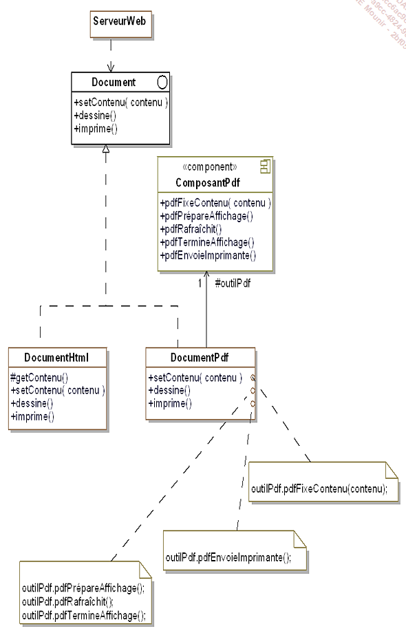

# DESIGN PATTERN C# #

## Comment on est noté ? ##

- Projet application C# console avec des design patterns : 1 mini projet par console
- QCM
- Rendre prise de note, repo Git bien documenter avec les prises de note de la semaine et les exercices

Liste des designs patterns : builder, factory method, protoype, singleton, adapter, bridge, composite, facade, flyweight, proxy , chain of responsabilty, command , interpreter, iterator, mediator, memento, observer, state, strategy, template method, visitor

Pour vendredi, TP noté à rendre : 
Créer une (ou plusieurs) application en C# , illustrant les patterns vus en cours cette semaine. Vous pouvez travailler en groupe de 4 maximum (je conseille fortement de travailler seul, la notation sera plus sèvere pour un groupe) . J'attends au minimum une application console.

## Définition ##

- Schéma d’objet qui permette de trouver une solution à un problème courant
- Conception POO et méthodes de bonne pratiques en POO

## Les Patterns ##

- Pattern de construction
- Pattern de structuration
- Pattern de comportement

## Abstract factory ##


- Permet de déresponsabiliser le classe mère. Elle permet de pouvoir modifier un comportement sans modifier la classe mère.
- Design pattern Abstract Factory

La classe Scooter est une classe mère d'héritage.
Les classes filles ScooterElectricité et ScooterEssence ont un "extends" pour que Scooter puisse étendre cette classe.

A quoi sert un pattern ?
Un pattern à pour but de régler tous les problèmes avec les créations de classes et permet de régler le surcharge en lien avec la classe parente


- Création d'une fabrique de vehicule en créant une interface qui contient les signatures des fonctions
- La classes FabriqueVéhiculeElectrique et FabriqueVéhiculeEssence implémente une méthode qui permet de créer un scooter en fonction de son type ScooterElectrique ou ScooterEssence.
- Création d'une classe abstraite Automobile
- Toutes les méthodes seront en Protected

## Pattern Builder ##


- Créer un constructeur de liasse de documents sans connaitre le type pdf ou html attendu
- Structure de données
- Insatnce de classe
- 2 types de documents différents
- Création d'objets complexes sans avoir à s'occuper des problèmes d'implémentations

Ce modèle est utilisé pour séparer la mise en œuvre d'un cas particulier de la logique / du client.
Le client (utilisateur physique ou logiciel) doit créer des objets complexes sans en connaître l'implémentation.
Créez des objets complexes avec plusieurs implémentations.


## Factory Method ##

### Générique ###


### Final ###


## Pattern Singleton ##

Le pattern singleton est utilisé pour créer une instance unique d'une classe
Le pattern est succeptible d'utiliser ce type d'instance unique

Notre application va utiliser la classe liasse viarge (LiasseVierge) qui ne posséderra qu'une seule instance
Chaque classe qui utilise la liasse vierge doit avoir accès
à la même instance. On doit surtout s'arranger pour qu'on ne puisse pas en créer de nouvelles
(avec l'opérateur new).

Le pattern prototype permet la création d'objets à partir d'autre objets appelés "prototypes" disposant d'une méthode Clone() qui retourne un objet identique

## Code du Pattern Singleton ##

code + schéma du pattern prototype
lien utile : <https://docs.microsoft.com/fr-fr/dotnet/api/system.object.memberwiseclone?view=net-6.0>

### Main ###

```csharp

        static void Main(string[] args)
        {
            Vendeur vendeurA = Vendeur.getInstance();
            vendeurA.nom = "BOB";
            vendeurA.prenom = "pop";
            
            Vendeur vendeurB = Vendeur.getInstance();
            vendeurB.nom = "Thriller";
            vendeurB.prenom = "Koko";


            Console.WriteLine("Vendeur A : ");
            Console.WriteLine("Nom : " + vendeurA.nom);
            Console.WriteLine("Prenom : " + vendeurA.prenom);

            Console.WriteLine("Vendeur B : ");
            Console.WriteLine("Nom : " + vendeurB.nom);
            Console.WriteLine("Prenom : " + vendeurB.prenom);     
        }

```

### Vendeur ###

```csharp

public class Vendeur
{
    private static Vendeur _instance = null;

    public String nom { get; set; }
    public String prenom { get; set; }

    private Vendeur()
    {
    }

    public static Vendeur getInstance()
    {
        if (_instance == null)
        {
            _instance = new Vendeur();
        }
        return _instance;
        
    }
}
```

Les patterns de structure ou de structuration

Intro

Les patterns de structurations permettent de faciliter l'indépandance de l'interface d'un objet et de son implémentation.

En fournissant les interfaces ce pattern permet d'encapsuler la composition des objets
Cela augmente le niveau d'abstraction d'un système donnée un peu à la manière des patterns de création qui encapsulent la création d'objets
Ces patterns mettent en avant les interfaces

### Les différences héritage et compositions ###

--> L'héritage et la composition sont 2 concepts de la POO <--

L'héritage est la capacité d'une classe à hériter des propriétés et du comportement d'une classe parent en l'étendant, tandis que Composition est la capacité d'une classe à contenir des objets de différentes classes en tant que données membres.
 En termes simples, Composition et Héritage consistent à fournir des propriétés ou un comportement supplémentaires à une classe.


#### Héritage ####

```csharp
class Vehicule:
 pass

class Bicycle(Vehicule)
 pass
```

#### Composition ####

```csharp
class Engine:
 pass

class Car:
 def __init__(self):
     self.engine = Engine()
```

Souces :
  <https://leandeep.com/h%C3%A9ritage-vs-composition-en-programmation-orient%C3%A9e-objet/>
  <https://fr.sawakinome.com/articles/programming/difference-between-inheritance-and-composition.html>

## Pattern Adapter ##

Le but de ce pattern est de convertir l'interface d'une classe donnée en une interface attendue par des clients afin qu'ils puissent travailler ensemble.
En résumé, il permet de donner à une classe existante une nouvelle interface pour répondre aux besoins d'un client.



#### Explication du design pattern + code ####

Le composant pdf est l'adapteur

```csharp
//composition
protected ComposantPdf outilPdf = new ComposantPdf();
```
