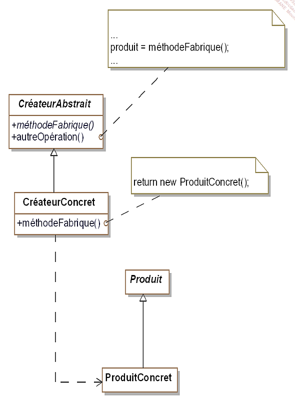

# DESIGN PATTERN C# #

## Comment on est noté ? ##

- Projet application C# console avec des design patterns
- QCM
- Rendre prise de note, repo Git bien documenter avec les prises de note de la semaine et les exercices

## Définition ##

- Schéma d’objet qui permette de trouver une solution à un problème courant
- Conception POO et méthodes de bonne pratiques en POO

## Les Patterns ##

- Pattern de construction
- Pattern de structuration
- Pattern de comportement

## Abstract factory ##


- Permet de déresponsabiliser le classe mère. Elle permet de pouvoir modifier un comportement sans modifier la classe mère.
- Design pattern Abstract Factory

La classe Scooter est une classe mère d'héritage.
Les classes filles ScooterElectricité et ScooterEssence ont un "extends" pour que Scooter puisse étendre cette classe.

A quoi sert un pattern ?
Un pattern à pour but de régler tous les problèmes avec les créations de classes et permet de régler le surcharge en lien avec la classe parente


- Création d'une fabrique de vehicule en créant une interface qui contient les signatures des fonctions
- La classes FabriqueVéhiculeElectrique et FabriqueVéhiculeEssence implémente une méthode qui permet de créer un scooter en fonction de son type ScooterElectrique ou ScooterEssence.
- Création d'une classe abstraite Automobile
- Toutes les méthodes seront en Protected

## Pattern Builder ##


- Créer un constructeur de liasse de documents sans connaitre le type pdf ou html attendu
- Structure de données
- Insatnce de classe
- 2 types de documents différents
- Création d'objets complexes sans avoir à s'occuper des problèmes d'implémentations

Ce modèle est utilisé pour séparer la mise en œuvre d'un cas particulier de la logique / du client. 
Le client (utilisateur physique ou logiciel) doit créer des objets complexes sans en connaître l'implémentation. 
Créez des objets complexes avec plusieurs implémentations.


## Factory Method ##

### Générique ###


### Final ###



## Pattern Singleton ##

Le pattern singleton est utilisé pour créer une instance unique d'une classe
Le pattern est succeptible d'utiliser ce type d'instance unique

Notre application va utiliser la classe liasse viarge (LiasseVierge) qui ne posséderra qu'une seule instance
Chaque classe qui utilise la liasse vierge doit avoir accès
à la même instance. On doit surtout s'arranger pour qu'on ne puisse pas en créer de nouvelles
(avec l'opérateur new).

Le pattern prototype permet la création d'objets à partir d'autre objets appelés "prototypes" disposant d'une méthode Clone() qui retourne un objet identique

## Code du Pattern Singleton ##

code + schéma du pattern prototype
lien utile : <https://docs.microsoft.com/fr-fr/dotnet/api/system.object.memberwiseclone?view=net-6.0>

### Main ###

```csharp

        static void Main(string[] args)
        {
            Vendeur vendeurA = Vendeur.getInstance();
            vendeurA.nom = "BOB";
            vendeurA.prenom = "pop";
            
            Vendeur vendeurB = Vendeur.getInstance();
            vendeurB.nom = "Thriller";
            vendeurB.prenom = "Koko";


            Console.WriteLine("Vendeur A : ");
            Console.WriteLine("Nom : " + vendeurA.nom);
            Console.WriteLine("Prenom : " + vendeurA.prenom);

            Console.WriteLine("Vendeur B : ");
            Console.WriteLine("Nom : " + vendeurB.nom);
            Console.WriteLine("Prenom : " + vendeurB.prenom);     
        }

```

### Vendeur ###

```csharp

public class Vendeur
{
    private static Vendeur _instance = null;

    public String nom { get; set; }
    public String prenom { get; set; }

    private Vendeur()
    {
    }

    public static Vendeur getInstance()
    {
        if (_instance == null)
        {
            _instance = new Vendeur();
        }
        return _instance;
        
    }
}
```
